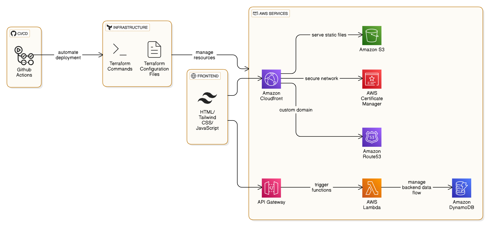
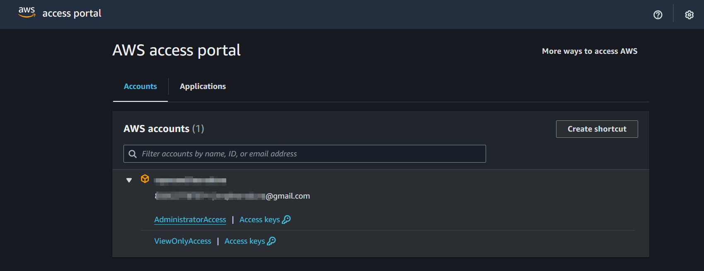
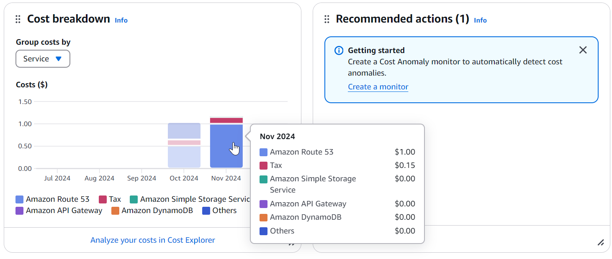

## **Introduction**
<p style="text-align: justify;">
The <a href="https://cloudresumechallenge.dev/docs/the-challenge/aws/" target="_blank">The AWS Cloud Resume Challenge</a> was created by Forrest Brazeal, it's an inspiring project that encourages individual challengers to build a resume or portfolio website on cloud while utilising various services and best practices, providing a hands-on opportunity to showcase cloud skills.
</p>

### **Why did I do it?**
<p style="text-align: justify;">
I came across this challenge early 2024 when I was looking around a plethora of interesting projects online that I could dive on outside my regular work routine. Then, I've stumbled upon some blogs on a number of well-known platforms sharing their journey on how they've experienced growth in both aspects of technical and non-technical situation.

As a jiu-jitsu practitioner myself my ethos is "growth mindset" and Ganbatte! - The Japanese art of always moving forward. I was drawn to this challenge because I saw a golden opportunity to cyclically fail and learn which is exactly aligned to my ethos as a grappler and an engineer.
</p>


### **Prerequisites**
<p style="text-align: justify;">

The entry to barrier for this challenge is atleast to gain a fundamental understanding of AWS services, API, Python, Javascript, HTML & CSS, etc. I would like to believe that once I've establish the fundamentals and concepts of these technologies and have dived in head first I'll have a decent foundation to navigate around and try to implement the solution for this project.

The usuals for me when it comes to checking out resources that in my opinion provides a strong blueprint to work with in gaining knowledge and steering in the right direction are the following:
- <a href="https://roadmap.sh/full-stack">Roadmap.sh - Full Stack</a>: HTML & CSS, Tailwind CSS, Javascript, node.js, RESTful API's, 
- <a href="https://github.com/milanm/DevOps-Roadmap" target="_blank">DevOps-Roadmap</a>: CI/CD, Networking, Infrastructure as Code(IaC), Git, Github Actions, Python, AWS services, NoSQL Databases, Monitoring & Observability, etc. and did I say most of them are FREE.

Establishing a strong foundation would be the best bet wether it's navigating through roadmap or actual practical experience will propel this challenge in a continuous learning mindset.
</p>

<p style="text-align: justify;">

### **The Challenge**

#### **Setup and safety**
Before I started the journey, I'll need to make sure I have the right gear and provisions. I chose to setup AWS Organizations by utilising a command line tool like [org-formation-cli](https://github.com/org-formation/org-formation-cli) because this is how it's implemented in medium to large sized Technology companies and would be a great way to learn how to do this from ground up. In addition billing alerts were also in place to avoid any unexpected charges.



#### **Certification prep**
I have an upcoming certification renewal for AWS Certified Developer and Hashicorp Certified Terraform Associate so I would say I have already establish a practical sense of engineering background to initiate with this challenge. However, I'm still up for the cert renewal!

#### **Building the frontend**: 
I'm by no means a frontend guy, heck I suck at making things look pretty and awesome but with the help of [Astro](https://astro.build/), [Aria Templates](https://aria.devdojo.io/), [Tailwind CSS](https://tailwindcss.com/) and Javascript I've customised the website to look minimalistic and with an option to print or download my resume, include a projects/blog section and yes! go dark mode 🖤.

These are the high-level steps that was employed to build the frontend section.

1. Custom domain name from [namecheap.com](https://www.namecheap.com/)
2. Utilise these AWS Services:
    - S3 to store static content, Also S3 versioning was enabled just in case I needed to rollback some files.
    - Route53 to handle DNS Services
    - Cloudfront to geographically deliver the content faster to edge networks
    - Certificate Manager to secure communication using SSL/TLS certificate between applications and users.

#### **Building the Backend**

Now that I have a frontend, it's time to build the backend! I made these into a separate repository to have a clear separation of development workflow because they both require a different set of tools and frameworks including reducing future version control conflicts. This covers AWS serverless technologies, REST APIs, and source control. 

These are the high-level steps that was employed to build the backend section.
1. DynamoDB to manage and store the visitor_counter table.
2. API Gateway (APIGW) to manage requests from your web application to the database. 


#### **frontend / Backend integration** 
It's time to bring it all together! I've learn how to integrate the frontend and backend of the website including how to write simple Cypress smoke tests. The main objective of this section is to display the `visitor_counter` table in my website to keep track of the visitor tally. This can be implemented by a Python Lambda Function with an APIGW route using a POST method for eg. in Terraform that would be under the `aws_api_gateway_integration` resource.


Provide examples and best practices for using these services in the context of the challenge.
Compare the integration of AWS services to Jiu-Jitsu transitions, emphasizing the importance of fluidity, timing, and precision.

#### **Automation / CI/CD**
This is where things get really exciting! In this section, The need to automate the deployment of the website and set up continuous integration using Github Actions by defining custom deployment workflows in the repository. This is triggered when a change is pushed to a branch.

These are the high-level steps that was employed to build the automation and CI/CD section.
1. Terraforming the Frontend and backend. I opted to do this earlier rather than later starting in the Frontend Infrastructure section.
2. Creating an separate workflow deployment pipeline for the frontend infrastructure and deployment. Wherein, triggering the website deployment will depend upon completion of the infrastructure this is to be certain that I have the appropriate setup before I proceed with the actual deployment (Upload of s3 files in this case)
</p>

#### **Security and Best Practices**
<p style="text-align: justify;">

**Security Considerations**

- **Securing the Public RESTful API**

  **Why it's important?**
  - prevent **denial-of-wallet** attack or **bill spamming**
  - prevent malicious API requests or using the API in a way that is not intended or authorized, such as trying to access sensitive data to perform unauthorized actions.

  The API is a public API, connected to *[raymund.cloud](https://www.raymund.cloud)*, which means it's accessible to anyone on the internet. As a result, anyone can find and make requests to the API directly without any authentication or authorization. To minimize some of this attack implementing a guardrail like *rate limiting* could be beneficial.
  
  **How to implement an API rate limit?**

  - This can be achieved in the resource for the API Gateway in your Terraform code.

  ```code
  resource aws_api_gateway_method_settings "api_rate_limit"
  ...
  settings {
    throttling_rate_limit  = 10
    throttling_burst_limit = 5
  }
  ```
  
- **Cross Origin Resource Sharing (CORS)**

  **Why I think we Need CORS?**

  It's mentioned in [OWASP](https://owasp.org/www-project-web-security-testing-guide/latest/4-Web_Application_Security_Testing/11-Client-side_Testing/07-Testing_Cross_Origin_Resource_Sharing) because it's related to several of the risks listed in the OWASP Top 10, particularly those related to authentication, authorization, and input validation.

  * Think of it like a *neighborhood with different houses*. Each house represents a website or domain. The *same-origin policy* is like a rule that says you can only visit houses on the same street as where you live. You can't just walk into a house on a different street without permission.

  * The *same-origin policy* is like a rule that says you can only visit houses on the same street as where you live. It prevents scripts from accessing resources (like data or websites) that are on a different domain (or "house") than where the script is running. This is a security feature to prevent bad scripts from accessing sensitive data.

  * However, sometimes you need to visit a house on a different street (or access resources from another domain). That's where *CORS* comes in. *CORS* is like a permission slip that allows you to visit a house on a different street. The homeowner (the server) can give you permission to visit, and you can then talk to the person living in that house (access their data or resources).

  * Great resource to understand [CORS](https://auth0.com/blog/cors-tutorial-a-guide-to-cross-origin-resource-sharing/) by examples.

So security, I think it's quite relatable with training Jiu-Jitsu as you develop *situational awareness* as you assess what you are currently facing  - top, bottom, or inverted position? it really matters because you can plan your next course of action or anticipate what your training partner's next move might be. Likewise, with API rate limit you can anticipate the intention of bad actors by implementing guardrails and only allowing what's best for your application or situation.
</p>

#### **Testing and Deployment**
<p style="text-align: justify;">

This section is inline with *REL08-BP02 Integrate functional testing as part of your deployment* which is a component of the [Reliability Pillar - AWS Well-Architected Framework](https://docs.aws.amazon.com/pdfs/wellarchitected/latest/reliability-pillar/wellarchitected-reliability-pillar.pdf#welcome). To integrate this into the CI/CD pipeline a step to perform cypress test was implemented in Github Actions. It's a simple unit test to check the title header is correct and we can actually load the website.

### **Cost**

This section is sort of a deal maker it provides a guesstimate on what we should expect with using these AWS services. I think it's a great investment the tradeoff with learning is exponential versus the cost.
Don't get caught with face-first into a pit of unexpected expenses. Instead, give AWS' API Gateway and Lambda services a shot – they're free as a bird (sometimes) and can help you keep your budget in check!



**Other costs**: Custom domain name: *\$4 USD* from Namecheap

Also, it might be a good idea to disable ***AWS WAF*** (AWS Web Application Firewall) as this will incur some additional cost but if you don't mind it's great to have this in your security toolkit.

### **Conclusion**

This project will hopefully teach you to fail forward and be resilient whether it's figuring out how to handle the logic of the visitor counter tally in the backend, attempting to apply a CSS in the typing animation, or troubleshooting that dreaded **503, 400, and DNS_PROBE_ERR** it will surely give you a head to scratch. There is no secret sauce in completing this challenge I believe it's a matter of getting lost in the trenches and finding your way back in that stackoverflow tab that is hiding underneath 95 layers of my hoarded opened browser tabs.

I would like to end this with my ethos of Ganbatte! or doing my best with what I have and taking on the difficulties head on and also being comfortable that failure is inevitable. That is why I think I've enjoyed tackling this project because it has enhanced and strengthened my mindset to grow on and off the grappling mats emphasizing the importance of discipline, perseverance, and Kaizen (continuous improvement).


Checkout this project in Github.
☁️ The AWS  Cloud Resume Challenge ☁️
- [Frontend section](https://github.com/araxia55/aws-crc-frontend)
- [Backend section](https://github.com/araxia55/aws-crc-backend)
- [Portfolio website](https://www.raymund.cloud)
</p>

