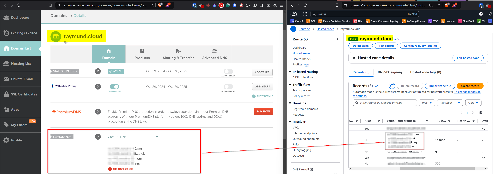

## Intro ##
Custom domain names allows us to use a personalised and professional-looking web address for your website, and can help you build a stronger brand identity. To use a custom domain name, you will need to register it with a domain registrar and configure it to point to your web hosting account.

We can frame the **custom domain names** like a *personalised license plate*, the **domain registrar** is like the authority that *issues* license plates, and the **web hosting account** is like the *car* itself. By registering your custom domain name and configuring it to point to your web hosting account, you can create a unique and memorable web address for your website, just as you can create a unique and memorable license plate for your car.

## Quick Start Guide ##
For the sake of brevity this step is somewhat manual as the need to enter the Name servers in the hosting provider is needed but nevertheless, it would be possible to automate.

1. Get a custom domain from [Namecheap.com](https://www.namecheap.com/domains/) or check the availability in  the registered domains in AWS Route53 via the console.
2. Create a Route53 hosted zone using Terraform.
- Sample [terraform configuration](https://github.com/araxia55/aws-crc-frontend/blob/main/infra/route53.tf) for Route53.
- Run `terraform init` then `terraform apply`.
3. Once the Route53 Hosted zone and domain is created and registered it needs to point to the DNS service name servers which can be found in the Route53 hosted zone.

In the `Namecheap` dashboard select the purchased domain name (eg. `raymund.cloud`) then hit `MANAGE` -> `NAMESERVERS1` -> `Custom DNS` -> `ADD NAMESERVER`

4. Test - The DNS Nameserver population might take a while around 24-48 hrs. Afterwards, try to load the custom domain name.

## What's Next - How Automate DNS Name server population? ##

The DNS name server population could be automated by utilising the [Namecheap API](https://www.namecheap.com/support/knowledgebase/article.aspx/10502/2208/namecheap-terraform-provider/). However, upon checking the current requirements there should be atleast the following in your account:

- Have at least 20 domains under your account
- Have at least $50 on your account balance
- Have at least $50 spent within the last 2 years

With these in mind at this point automation is not the answer for personal/homelab accounts.

## Conclusion ##

Setting up a custom domain name in AWS Route53 can significantly enhance your online presence by providing a professional and memorable web address. While the initial setup process involves manual steps, such as configuring name servers, it is straightforward and manageable. For those looking to automate the process, the Namecheap API offers a solution, albeit with certain prerequisites. By following this guide, you can successfully configure your custom domain and take the first step towards a more personalized and branded online identity.