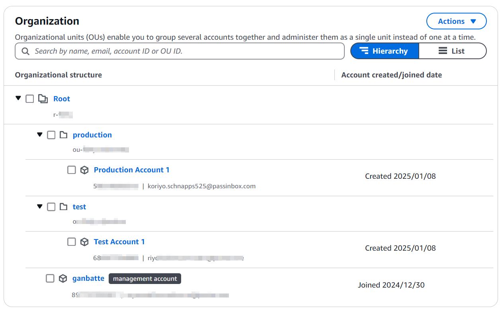

## Introduction ##

[AWS Organizations](https://docs.aws.amazon.com/organizations/latest/userguide/orgs_introduction.html) is a service that helps you centrally manage and govern your environment as you grow and scale your AWS resources. With [org-formation](https://github.com/org-formation/org-formation-cli), you can create accounts, organize them in hierarchies, apply policies, and automate account creation and management. 

## Project Overview ##


## Prerequisites ##

1. Clone this [repository](https://github.com/araxia55/aws-organizations.git).
2. Install [aws-cli](https://docs.aws.amazon.com/cli/latest/userguide/getting-started-install.html).
3. Create an administrator account in the AWS console (don't use your root account).
    - Grant Policy:
      ```
      AdministratorAccess 
      ```
4. Setup with the Administrator keys. 
    ```
    aws configure
    ```
5. Install **org-formation**.
    ```bash
    npm install -g aws-organization-formation
    ```

## Quick Start Guide

To get started with AWS Organizations utilising org-formation, follow these steps:

1. **Create an Organization**: Set up your organization in the **aws-cli** (This can also be performed via the AWS console).
    ```
     aws organizations create-organization --feature-set ALL
     ```
2. **List Accounts**: Check the structure of existing accounts.
    ```bash
    aws organizations list-roots
    aws organizations list-accounts
    ```
3. **Initialise org-formation**: 
    ```
    cd aws-organizations && org-formation init organization.yml
    ```
4. **Validate Accounts**: You may need to check the verification email sent by AWS to the email address indicated as your management account this can be found in the *organization.yml* file.
5. **Organize and Add Accounts in OU (*Organizationl Unit*)**: Add existing accounts or create new ones. 
    - In your code editor include additional OU's and accounts by modifying the structure of the *organization.yml*.

    - Checkout this sample Cloudformation code for [organization.yml](https://github.com/araxia55/aws-organizations/blob/master/organization.yml)

    - Great resource to get the [org-formation grips](https://dev.to/oconijn/off-to-a-great-start-with-aws-organizations-1i74) started.

6. Hide PII (Personal Identifiable Information):

- Use [**Github Variables**](https://docs.github.com/en/actions/writing-workflows/choosing-what-your-workflow-does/store-information-in-variables) to hide the root email as we don't like spam.
- Use an email alias service (proton.me) so all the RootEmail specified are just an alias to the real account.

## What's the End Goal? ##
The end goal is to automate the management and deployment of AWS accounts and keep track of user creation, removal, and privileges. Nevertheless, this can be achieved by version controlling the *organization.yml* file.

#### The pipeline will be similar to this. ####


#### AWS Organizations in birds-eye view. ####



## Testing the Accounts ##

If you want to test the *OrganizationAccountAccessRole* after successful deployment. 
1. Login to the Administrator account in the console.
2. Switch to the newly created account by clicking "Switch Role".
- To obtain the *Account ID* you may run `aws organizations list-accounts` and check the `Id` key.
- Enter *OrganizationAccountAccessRole* as the "IAM role name".


3. You can now switch to these accounts from the account menu.


## Conclusion ##
- AWS Organizations aims for better data governance, security boundaries, scalability, and cost monitoring. By storing data in different accounts, it's easier to control who has access to what data and demonstrate compliance with regulations like GDPR. Moving critical resources to separate accounts allows for easier management of IAM permissions and security controls at the account level. Having multiple accounts also helps to avoid service limits issues, as each team can have their own account with its own set of resources. Dividing the system over several accounts also reduces the blast radius, limiting the impact of unwanted side-effects of changes. Additionally, org-formation is a neat tool to version control and keep track of your Identity and Access Management.

- **Why I didn't utilise org-formation's CICD pipeline? (use Github instead)**<br>
  The command below won't work if you have a *newly* created AWS account. 
  Because this command will create a CodeCommit repository however, AWS have stopped onboarding new customers for CodeCommit starting July 25th, 2024. Checkout this [re:Post](https://repost.aws/questions/QUqBTbjO2aSfebjm-yFzpb3A/cannot-create-first-repository-in-codecommit) about AWS's statement. But if you've created an account prior to the cease of CC you can still create a repository and I've tested this to work in one of my old accounts.
  ```
  org-formation init-pipeline
  ```
  </br>